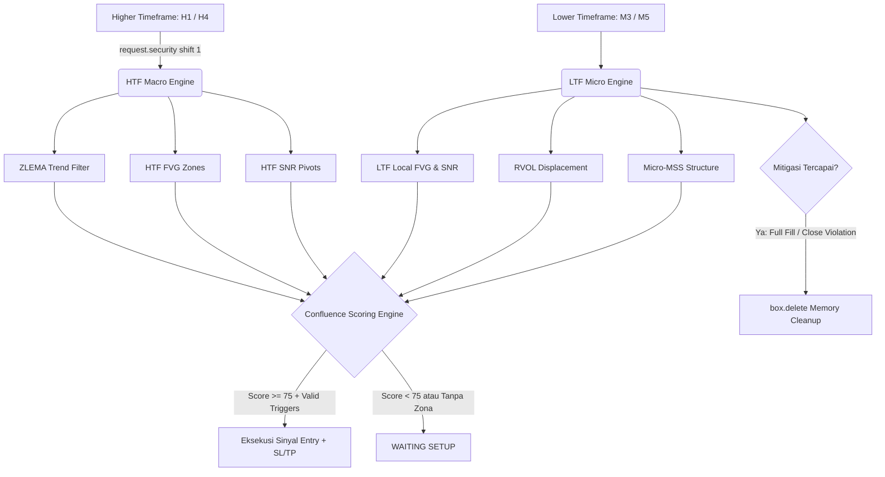

2# Non-Lagging Multi-Timeframe Quant Engine (ZLEMA + Dual-TF FVG & SNR)

Sistem indikator kuantitatif berbasis **Pine Script v6** yang dirancang untuk strategi *Intraday Scalping* ($M3, M5, M15$) dengan menyelaraskan *Order Flow* institusional dari *Higher Timeframe* ($M30, H1, H4$). 

Indikator ini menggabungkan filter tren fase rendah (*Zero-Lag*), pemetaan zona ketidakseimbangan likuiditas (*Fair Value Gap*), struktur fraktal horizontal (*Support & Resistance*), sistem penilaian konfluensi (*Signal Scoring*), serta visualisasi level risiko (SL/TP) otomatis.

---

## 1. Arsitektur Matematika & Algoritma Sistem



### A. Zero-Lag Exponential Moving Average (ZLEMA)
Moving Average standar memiliki pergeseran fase (*phase lag*) sebesar $\frac{n - 1}{2}$. ZLEMA menghilangkan keterlambatan ini dengan mendekomposisi momentum harga sebelum proses *exponential smoothing*:
$$P_{\text{adjusted}} = 2 \cdot P_t - P_{t - \text{lag}}, \quad \text{di mana } \text{lag} = \left\lfloor \frac{n - 1}{2} \right\rfloor$$
$$\text{ZLEMA}_t = \alpha \cdot P_{\text{adjusted}} + (1 - \alpha) \cdot \text{ZLEMA}_{t-1}, \quad \alpha = \frac{2}{n + 1}$$

### B. Perlindungan Anti-Repainting HTF
Semua data dari Higher Timeframe diekstraksi menggunakan tuple tertutup dengan pergeseran bar internal:
* Data HTF diakses melalui `close[1]`, `high[3]`, dan `low[1]` di dalam fungsi turunan `request.security()`.
* Parameter `lookahead = barmerge.lookahead_off` diaktifkan untuk memastikan nilai tidak berubah setelah bar terbentuk (*zero future-leak bias*).

### C. Pemetaan & Skor Kekuatan Zona (Zone Strength Score)
* **Fair Value Gap (FVG):** Mengukur ketidakseimbangan likuiditas (*liquidity imbalance*).
  * *Bullish FVG:* Terkonfirmasi jika $Low_{t-1} > High_{t-3}$.
  * *Bearish FVG:* Terkonfirmasi jika $High_{t-1} < Low_{t-3}$.
  * *Skor FVG (60 - 99):* Dihitung dari rasio celah (*gap*) terhadap $ATR_{\text{HTF}}$:
    $$\text{Score}_{\text{FVG}} = \min\left(99, \; 60 + \left\lfloor \frac{\text{Gap Size}}{ATR_{\text{HTF}}} \times 25 \right\rfloor\right)$$
* **Support & Resistance (SNR):** Titik fraktal diskrit berbasis *Pivot High* dan *Pivot Low*.
  * *Skor SNR (65 - 95):* Dihitung dari rasio penolakan sumbu (*rejection wick ratio*) pada candle pivot pembentuknya.

### D. Siklus Hidup & Mitigasi Objek (*Garbage Collection*)
Kotak FVG atau SNR akan langsung dihapus dari grafik dan alokasi memori array (`box.delete`) jika salah satu kondisi mitigasi berikut terpenuhi:
1. **Full Fill:** Ekor candle telah menembus batas terjauh zona ($Low \le Bottom$ untuk Bullish FVG).
2. **Invalidation Close:** Terjadi *candle close* di luar batas zona ($Close < Bottom$ untuk Bullish FVG/Support).

---

## 2. Matriks Penilaian Sinyal (Signal Scoring Matrix)

Sinyal eksekusi hanya akan dipicu jika total skor kumulatif mencapai ambang batas minimal (**Score $\ge 75$**).

| Parameter Konfluensi | Bobot Poin | Deskripsi Logika |
| :--- | :---: | :--- |
| **HTF Trend Alignment** | **+25** | Posisi harga berada searah dengan lereng (*slope*) MA HTF ($Close > ZLEMA$). |
| **HTF Liquidity Tap** | **+25** | Harga LTF sedang melakukan *pullback* menyentuh area FVG/SNR HTF aktif. |
| **LTF Confluence Zone** | **+15** | Sentuhan bertumpuk dengan FVG/SNR internal TF lokal ($M3/M5$). |
| **Candle Rejection / Engulfing** | **+15** | Ekor penolakan $\ge 35\%$ rentang bar ATAU *engulfing body close*. |
| **Institutional RVOL Spike** | **+10** | Volume transaksi saat candle konfirmasi $\ge 1.2\times$ volume rata-rata. |
| **Micro-MSS Displacement** | **+10** | Rasio badan candle (*body*) $\ge 45\%$ dari rentang dengan penembusan harga terdekat. |

### Klasifikasi Kualitas Sinyal:
* **Grade A+ (Skor 85 - 100):** Setup probabilitas tinggi. Seluruh filter volume, struktur mikro, dan zona HTF terpenuhi.
* **Grade A (Skor 75 - 84):** Setup valid standar. Memenuhi batas minimum konfluensi institusional.
* **Invalid (Skor < 75):** Kondisi *no-trade*. Status pada monitor dashboard: `WAITING SETUP`.

---

## 3. Skema Visual Grafik & Antarmuka Dashboard

### Elemen Visual pada Chart:
* **Garis Tebal Hijau/Merah:** Baseline HTF Moving Average (ZLEMA/ALMA).
* **Box Terang (Hijau / Merah Terang):** Area HTF FVG dengan label format `[H1] FVG Bull | Scr: XX`.
* **Box Redup (Bayangan Abu-abu Transparan):** Area HTF SNR dengan label format `[H1] SNR Sup/Res`.
* **Box Biru / Oranye:** Area likuiditas internal LTF `[M5]`.
* **Label Panah Hijau / Merah:** Titik eksekusi beli/jual yang mencantumkan skor, *grade*, level SL, dan TP.
* **Garis Putus-Putus Merah & Hijau:** Proyeksi target Stop Loss dan Take Profit.

### Dashboard Monitor:
Dapat diposisikan di 4 sudut grafik dengan 4 pilihan skala ukuran:
* **Ukuran Dashboard:** `Sangat Kecil (Tiny)` *(optimal untuk layar ponsel/mobile)*, `Kecil`, `Normal`, dan `Besar`.
* **Metrik Real-time:** Menampilkan status bias tren makro, rasio lonjakan volume (RVOL), status interaksi zona harga saat ini, live score konfluensi, dan status tindakan trading.

---

## 4. Prosedur Operasional Standar (SOP) Eksekusi Sinyal

```
     KONDISI HARGA
           │
           ▼
[1] Bias HTF Terkonfirmasi? (Harga di atas ZLEMA H1)
     ├── TIDAK ──► Jangan ambil posisi BUY
     └── YA ─────► Lanjut ke Langkah 2
           │
           ▼
[2] Terjadi Pullback ke Zona? (Harga menyentuh FVG/SNR H1 atau M5)
     ├── TIDAK ──► Tunggu (Dashboard: OPEN LIQUIDITY)
     └── YA ─────► Lanjut ke Langkah 3 (Dashboard: AT DEMAND / SUP)
           │
           ▼
[3] Validasi Mikro di LTF:
     ├── Volume Spike: RVOL >= 1.2x?
     ├── Candlestick: Wick Rejection >= 35% atau Engulfing?
     └── Struktur: Micro-MSS Displacement valid?
           │
           ▼
[4] Evaluasi Skor Akhir:
     ├── Skor < 75  ──► Sinyal ditolak (Dashboard: WAITING SETUP)
     └── Skor >= 75 ──► SINYAL VALID! Eksekusi BUY / SELL
```

### Aturan Eksekusi Beli (BUY Setup):
1. **Filter Makro:** Lereng ZLEMA HTF ($H1$) mengarah ke atas dan harga berada di atas garis ZLEMA.
2. **Retest Likuiditas:** Harga turun (*pullback*) masuk ke dalam kotak Demand (`[H1] FVG Bull` atau `[H1] SNR Sup`).
3. **Pemicu LTF ($M5$):** Terbentuk candle penolakan (*lower wick rejection*) atau *bullish engulfing* dengan volume di atas rata-rata ($\text{RVOL} \ge 1.2\text{x}$).
4. **Validasi Skor:** Skor pada chart menampilkan nilai $\ge 75$ (Grade A atau A+).
5. **Manajemen Risiko:**
   * **Entry:** Buka posisi pada harga penutupan (*market close*) candle sinyal.
   * **Stop Loss (SL):** Ditempatkan pada level SL yang tertera pada label sinyal:
     $$\text{SL} = \min(\text{Low}_{\text{candle}}, \text{Zone Bottom}) - (0.5 \times ATR_{\text{LTF}})$$
   * **Take Profit (TP):** Ditempatkan pada rasio $1:2$ sesuai proyeksi garis hijau pada grafik:
     $$\text{TP} = \text{Price}_{\text{entry}} + (\text{Price}_{\text{entry}} - \text{SL}) \times RRR$$

### Aturan Eksekusi Jual (SELL Setup):
1. **Filter Makro:** Lereng ZLEMA HTF ($H1$) mengarah ke bawah dan harga berada di bawah garis ZLEMA.
2. **Retest Likuiditas:** Harga naik (*pullback*) masuk ke dalam kotak Supply (`[H1] FVG Bear` atau `[H1] SNR Res`).
3. **Pemicu LTF ($M5$):** Terbentuk candle penolakan (*upper wick rejection*) atau *bearish engulfing* disertai lonjakan volume ($\text{RVOL} \ge 1.2\text{x}$).
4. **Validasi Skor:** Skor akumulasi $\ge 75$.
5. **Manajemen Risiko:**
   * **Entry:** Buka posisi Sell pada penutupan candle sinyal.
   * **Stop Loss (SL):**
     $$\text{SL} = \max(\text{High}_{\text{candle}}, \text{Zone Top}) + (0.5 \times ATR_{\text{LTF}})$$
   * **Take Profit (TP):** Target profit minimal rasio $1:2$:
     $$\text{TP} = \text{Price}_{\text{entry}} - (\text{SL} - \text{Price}_{\text{entry}}) \times RRR$$

---

## 5. Rekomendasi Parameter Konfigurasi

| Parameter | Scalping Agresif ($M1 / M3$) | Day Trading Presisi ($M5 / M15$) |
| :--- | :---: | :---: |
| **Higher Timeframe (HTF)** | `30` (M30) | `60` (H1) atau `240` (H4) |
| **Algoritma MA** | `ZLEMA` | `ZLEMA` |
| **Periode MA HTF** | `21` | `34` |
| **Min. RVOL Spike** | `1.1x` | `1.2x` |
| **Minimal Entry Score** | `70` | `75` |
| **Risk to Reward (RRR)** | `1:1.5` | `1:2.0` |
| **Ukuran Dashboard** | `Sangat Kecil (Tiny)` | `Kecil` / `Normal` |

---

## 6. Pertimbangan Mikrostruktur Pasar Nyata

1. **Spread & Slippage Saat Sesi Pergantian:** Pada instrumen dengan volatilitas tinggi (seperti XAUUSD atau Indeks), hindari membuka posisi pada timeframe $M3/M5$ saat peralihan sesi New York menuju Asia ($04:00 - 06:00$ WIB). Pelebaran spread dapat memicu Stop Loss prematur di luar zona kalkulasi ATR.
2. **Zona Unmitigated Historis:** Zona FVG atau SNR HTF bernilai skor tinggi yang belum tersentuh berhari-hari tetap valid sebagai area likuiditas utama (*magnet harga*). Jangan menghapus zona ini secara manual sampai harga mengujinya secara organik.
3. **Pemberitahuan Likuiditas Berita (News Event):** Matikan eksekusi sinyal 15 menit sebelum dan sesudah rilis berita ekonomi berdampak tinggi (*High-Impact News* seperti NFP, CPI, atau FOMC) karena *slippage* dapat merusak efektivitas rasio Risk-to-Reward.
